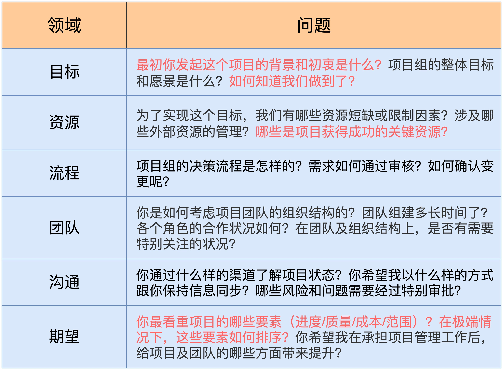

<!--
 * @Author: kunliang
 * @Date: 2023-04-23 14:22:56
 * @LastEditors: kunliang
 * @LastEditTime: 2023-04-23 15:56:24
 * @Description: file content
 * @FilePath: \checkforgaps\notes\启动：识别项目中的四类干系人.md
-->

### 项目中的四类干系人

- 高利益-高权力、 高利益-低权力、 低利益-高权力、 低利益-低权力

#### `高利益-高权力`代表：项目发起人

- 针对发起人做一轮全面而深入的了解。是非常有必要的

- 同时，为了管理好之后的沟通，你还需要约定好你们之间的沟通频率和方式，以便在项目进行的过程中做好实时同步

#### `低利益-高权力`代表：职能经理

- 强烈的态度背后，一定反馈了干系人对现状的某种认知
- 只有真正地理解了对方的逻辑，才有可能进一步对其施加影响

#### `高利益-低权力`代表：项目组成员

- 管理这类干系人的核心，就是做到项目事项的随时告知，及时通报项目的进度和困难

#### `低利益-低权力`代表：外围支持人员
